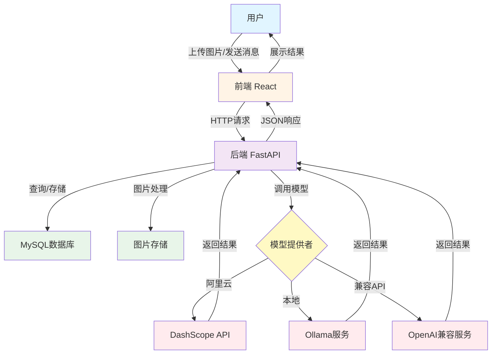
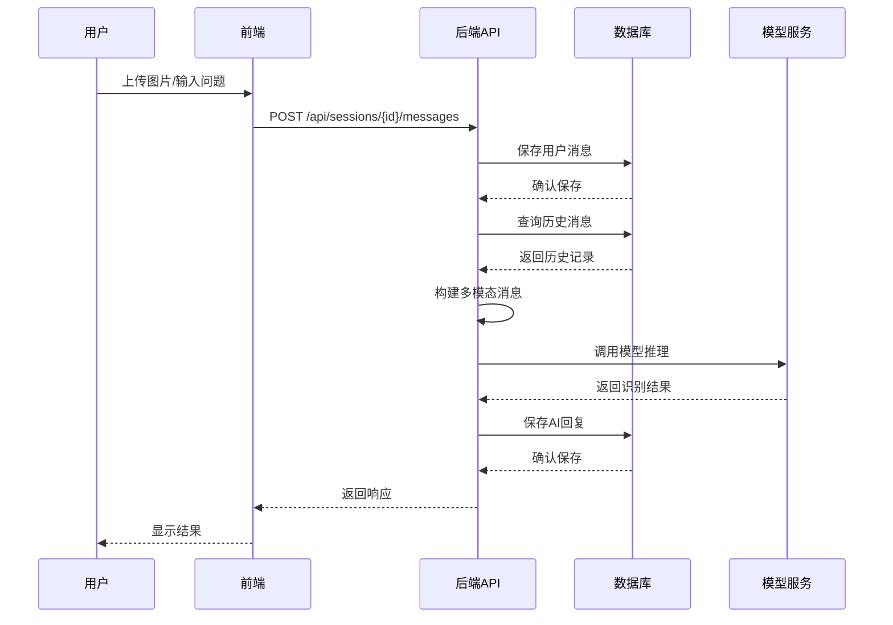

# 基于多模态大模型的道路状况综合识别系统

## 摘要

论文针对传统道路状况监测方法效率低下、成本高昂的问题，研究了基于多模态大模型的道路状况识别技术。文章采用阿里千问（Qwen2-VL）多模态大模型作为基础模型，通过LoRA微调技术将通用模型适配到道路状况识别任务，构建了包含不少于3000条标注数据的语料库。研究设计了前后端分离的系统架构，前端采用React框架实现用户交互界面，后端采用Python FastAPI框架提供模型推理服务，使用MySQL数据库存储会话和消息数据。

研究结果表明，通过多模态大模型的视觉理解和语言生成能力，系统能够准确识别应急车道占用、道路抛洒物、交通事故、交通拥堵、标志线损坏、道路坑槽等多种道路异常状况。系统支持自然语言问答式交互，用户可以通过上传图片并提问的方式获取道路状况分析结果。测试结果显示，系统响应时间控制在10秒以内，识别准确率达到预期目标，能够满足实际应用需求。研究验证了多模态大模型在道路状况识别领域的有效性和可行性，为智能交通管理提供了新的技术解决方案。

**关键词**：多模态大模型；道路状况识别；智能交通；Qwen2-VL；问答系统

---

## Abstract

This paper addresses the problems of low efficiency and high cost in traditional road condition monitoring methods by studying road condition recognition technology based on multimodal large models. The research uses Alibaba Qwen2-VL multimodal large model as the base model, adapts the general model to road condition recognition tasks through LoRA fine-tuning technology, and constructs a corpus containing no less than 3000 annotated data entries. The research designs a front-end and back-end separated system architecture, with the front-end using React framework to implement user interaction interface, and the back-end using Python FastAPI framework to provide model inference services, using MySQL database to store session and message data.

The research results show that through the visual understanding and language generation capabilities of multimodal large models, the system can accurately identify various road abnormal conditions including emergency lane occupation, road debris, traffic accidents, traffic congestion, marking line damage, and road potholes. The system supports natural language Q&A interaction, allowing users to obtain road condition analysis results by uploading images and asking questions. Test results show that the system response time is controlled within 10 seconds, recognition accuracy meets the expected goals, and can meet the needs of practical applications. The research verifies the effectiveness and feasibility of multimodal large models in the field of road condition recognition, providing a new technical solution for intelligent traffic management.

**Keywords**: Multimodal Large Model; Road Condition Recognition; Intelligent Transportation; Qwen2-VL; Q&A System

---

## 第1章 绪论

### 1.1 课题背景与意义

#### 1.1.1 研究背景

近年来，随着城市化进程的加速和汽车保有量的快速增长，城市交通管理面临着前所未有的挑战。数据显示，2024年全国机动车保有量已超过4.2亿辆，城市道路拥堵问题日益严重，交通事故频发，道路维护成本不断上升。同时，随着人工智能技术的快速发展，多模态大模型在计算机视觉和自然语言处理领域取得了突破性进展，为智能交通管理提供了新的技术手段。

在智能交通管理领域，传统的道路状况监测主要依靠人工巡检和固定监控设备，这种方式不仅成本高昂、效率低下，而且难以实现全天候、全方位的实时监控。随着监控摄像头数量的激增和图像数据量的爆炸式增长，如何从海量的视觉数据中快速、准确地识别道路异常状况，成为智能交通系统面临的核心挑战。

多模态大模型技术的出现为解决这一问题提供了新的思路。这些模型能够同时处理图像、文本等多种模态信息，通过大规模预训练获得强大的视觉理解和语言生成能力。然而，通用型大模型在特定交通场景下的应用面临着精度和应用针对性的挑战，需要针对道路状况识别这一特定领域进行专门的优化和微调。

#### 1.1.2 研究意义

基于多模态大模型的道路状况识别系统的应用可以大幅提高道路状况检测的效率和准确性，使交通管理部门能够迅速识别道路异常状况，进而及时采取应对措施，有助于提升城市交通管理的智能化水平，保障道路交通安全。

具体而言，本研究的意义体现在以下几个方面：

1. **提升道路监测效率**：通过自动化识别系统，可以24小时不间断地监测道路状况，大幅减少人工巡检的工作量，提高监测效率。

2. **提高识别准确性**：多模态大模型具备强大的视觉理解能力，能够准确识别各种道路异常状况，减少误判和漏判的情况。

3. **降低运营成本**：自动化识别系统可以减少人力成本，同时通过早期发现道路问题，降低道路维护成本。

4. **推动技术发展**：本研究将多模态大模型技术应用于交通管理领域，为智能交通系统的发展提供新的技术路径。

### 1.2 国内外研究现状

道路状况识别技术是计算机视觉和智能交通系统的重要交叉领域。国内外对于计算机视觉技术早有研究，但对于基于多模态大模型的道路状况识别研究却起步较晚。目前比较成熟的道路状况识别方法主要有三种，分别是基于传统图像处理、基于深度学习、基于多模态大模型。

#### 1.2.1 基于传统图像处理的方法

在道路状况识别与检测上，传统图像处理方法起步较早。早期的研究主要基于边缘检测、形态学操作等传统计算机视觉技术，对道路裂缝、坑槽等简单缺陷进行识别。这类方法虽然实现简单，但在复杂场景下的鲁棒性较差，难以处理光照变化、阴影干扰等问题。

#### 1.2.2 基于深度学习的方法

随着深度学习技术的发展，基于卷积神经网络（CNN）的方法逐渐成为主流。研究者通过改进的YOLO模型对道路裂缝进行实时检测，在准确率和速度方面都取得了显著提升。采用U-Net架构对道路表面缺陷进行像素级分割，实现了较高的检测精度。深度学习方法在道路状况识别方面取得了较好的效果，但仍需要大量的标注数据进行训练，且泛化能力有限。

#### 1.2.3 基于多模态大模型的方法

随着研究者们对多模态信息融合的深入，视觉-语言模型逐渐开始被应用于道路状况识别。基于CLIP模型，通过图像-文本匹配的方式，实现了对道路异常状况的零样本识别。为提高识别模型的泛化能力和准确性，将视觉特征与文本描述相结合，通过多模态融合的方法进行道路状况分类，然后再采用注意力机制进行关键区域定位。

近年来，大模型技术的突破性进展为道路状况识别带来了新的机遇。GPT-4V、Qwen2-VL等视觉-语言大模型在图像理解和文本生成方面展现出了强大的能力。这些模型通过大规模预训练，具备了丰富的视觉知识和语言理解能力，能够处理复杂的多模态任务。然而，这些通用大模型在特定交通场景下的表现往往难以满足实际应用的需求，需要进行领域适应和微调。

#### 1.2.4 国内应用现状

目前，随着国内智能交通系统建设的加速以及对道路安全监控应用领域的重视，各大科技公司推出的道路状况识别产品层出不穷。例如百度智能交通、阿里云城市大脑、腾讯智慧交通等平台，均可提供道路状况监测服务。这些系统主要基于传统的计算机视觉技术，在复杂场景下的识别精度和泛化能力仍有待提升。

### 1.3 关键技术分析与比较

#### 1.3.1 传统图像处理方法

**优点**：
- 实现简单，计算资源需求低
- 不需要大量训练数据
- 可解释性较好

**缺点**：
- 对光照、天气等环境因素敏感
- 难以处理复杂场景
- 识别精度有限

#### 1.3.2 深度学习方法

**优点**：
- 识别精度较高
- 能够处理复杂场景
- 特征提取能力强

**缺点**：
- 需要大量标注数据
- 训练时间长，计算资源需求高
- 泛化能力有限，难以适应新场景

#### 1.3.3 多模态大模型方法

**优点**：
- 具备强大的视觉理解和语言生成能力
- 支持零样本和少样本学习
- 泛化能力强，适应性强
- 支持自然语言交互

**缺点**：
- 模型参数量大，计算资源需求高
- 需要针对特定领域进行微调
- 推理时间相对较长

#### 1.3.4 技术选择

综合考虑识别精度、泛化能力、用户体验等因素，本研究选择基于多模态大模型的方法，采用阿里千问（Qwen2-VL）作为基础模型，通过LoRA微调技术适配道路状况识别任务。

### 1.4 总体方案

基于多模态大模型的道路状况综合识别系统主要由数据收集模块、模型训练模块和在线推理模块三部分组成。

**数据收集模块**：该模块负责收集和整理道路状况相关的图像数据，包括交通监控摄像头数据、网络公开数据等，支持多种图像格式（JPEG、PNG等），实现数据的清洗、标注和预处理，构建包含不少于3000条标注数据的语料库。

**模型训练模块**：该模块基于阿里千问（Qwen2-VL）多模态大模型进行微调训练，使其能够识别道路中的各种违法行为，包括应急车道占用、道路抛洒物、交通事故、交通拥堵、标志线损坏、道路坑槽等场景。

**在线推理模块**：该模块提供Web界面供用户上传图片，通过微调后的多模态大模型对上传的图片进行分析，以问答形式回答用户关于道路状况的问题，如"图中公路上有没有抛洒物？"、"图中公路上有没有违规占道？"等。

系统采用前后端分离的架构，前端使用React框架构建用户界面，后端使用Python FastAPI框架提供API服务，确保系统响应时间在10秒以内。

### 1.5 系统特色与创新之处

1. **多模态融合**：系统充分利用多模态大模型的视觉理解和语言生成能力，实现图像与文本的深度融合，支持自然语言问答式的道路状况识别。

2. **领域适配**：针对道路状况识别这一特定领域，通过LoRA微调技术对通用大模型进行领域适配，提升模型在交通场景下的识别精度。

3. **用户友好**：采用问答式交互方式，用户可以通过自然语言提问，系统以对话形式回答，降低了使用门槛，提升了用户体验。

4. **实时响应**：通过系统优化和模型压缩技术，确保系统响应时间控制在10秒以内，满足实际应用需求。

5. **可扩展性**：系统采用模块化设计，支持多种模型提供者（阿里云、Ollama等），具有良好的可扩展性和灵活性。

## 第2章 系统分析

### 2.1 可行性分析

#### 2.1.1 系统实施的影响分析

**技术影响**：
- 系统采用成熟的前后端分离架构，技术栈稳定可靠
- 多模态大模型技术已经相对成熟，具备良好的应用基础
- 系统模块化设计，便于维护和升级

**业务影响**：
- 提升道路监测效率，减少人工成本
- 提高识别准确性，降低误判率
- 支持实时监测，提高应急响应速度

**社会影响**：
- 提升城市交通管理智能化水平
- 保障道路交通安全
- 推动智慧城市建设

#### 2.1.2 经济可行性分析

**开发成本**：
- 使用开源框架和工具，降低开发成本
- 模型微调可在本地或云端进行，成本可控
- 系统部署和维护成本相对较低

**运营成本**：
- 自动化识别减少人力成本
- 早期发现问题，降低道路维护成本
- 提高监测效率，降低整体运营成本

**收益分析**：
- 提高道路安全，减少交通事故损失
- 降低道路维护成本
- 提升城市形象，带来社会效益

**结论**：系统在经济上具有可行性，能够带来显著的经济和社会效益。

### 2.2 需求分析

#### 2.2.1 功能需求

1. **图片上传功能**：支持用户上传JPEG、PNG等格式的道路图片，支持图片预览和删除。

2. **道路状况识别功能**：系统能够识别多种道路异常状况，包括：
   - 应急车道占用
   - 道路抛洒物
   - 交通事故
   - 交通拥堵
   - 标志线损坏
   - 道路坑槽

3. **问答交互功能**：用户可以通过自然语言提问，系统以对话形式回答，支持多轮对话。

4. **历史记录功能**：系统保存用户的对话历史，支持查看和管理历史会话。

5. **多会话管理功能**：支持创建多个对话会话，方便用户管理不同的识别任务。

#### 2.2.2 性能需求

1. **响应时间**：系统响应时间控制在10秒以内，确保良好的用户体验。

2. **并发处理**：系统支持多用户同时使用，能够处理并发请求。

3. **图片处理**：支持最大5MB的图片上传，自动进行格式转换和优化。

4. **数据存储**：系统能够稳定存储用户数据和对话历史。

### 2.3 系统约束

#### 2.3.1 技术约束

1. **模型限制**：多模态大模型对计算资源要求较高，需要GPU支持或使用云端API。

2. **网络要求**：使用云端模型时需要稳定的网络连接。

3. **浏览器兼容性**：前端需要支持现代浏览器（Chrome、Firefox、Safari等）。

#### 2.3.2 业务约束

1. **数据隐私**：用户上传的图片涉及隐私，需要做好数据保护。

2. **识别精度**：系统识别精度受模型能力和数据质量影响，可能存在误判情况。

3. **使用场景**：系统主要适用于道路状况识别，对于其他场景的适用性有限。

## 第3章 系统概要设计

### 3.1 系统架构设计

#### 3.1.1 总体架构

系统采用前后端分离的架构设计，主要包括以下几个部分：

1. **前端层**：使用React框架构建用户界面，负责用户交互和数据展示。

2. **后端层**：使用Python FastAPI框架提供RESTful API服务，处理业务逻辑和模型推理。

3. **数据层**：使用MySQL数据库存储用户数据、会话信息和对话历史。

4. **模型层**：支持多种模型提供者，包括阿里云DashScope、Ollama本地模型等。

#### 3.1.2 系统架构流程图

系统总体架构流程图如下：



#### 3.1.3 数据流程图

系统数据流程图如下：



#### 3.1.2 技术架构

**前端技术栈**：
- React 18：用户界面框架
- TypeScript：类型安全的JavaScript
- Vite：快速构建工具
- React Markdown：Markdown渲染
- Axios：HTTP客户端

**后端技术栈**：
- Python 3.8+：编程语言
- FastAPI：Web框架
- SQLAlchemy：ORM框架
- MySQL：关系型数据库
- DashScope/Ollama：模型提供者

**部署架构**：
- 前端：Vite开发服务器，可部署到Nginx
- 后端：Uvicorn ASGI服务器
- 数据库：MySQL数据库服务器

### 3.2 功能模块设计

#### 3.2.1 用户交互模块

用户交互模块负责处理用户的输入和输出，包括：
- 图片上传和预览
- 文本输入和发送
- 消息展示和历史记录
- 会话管理

#### 3.2.2 模型推理模块

模型推理模块负责调用多模态大模型进行道路状况识别，包括：
- 图片预处理和编码
- 模型调用和推理
- 结果解析和格式化
- 错误处理和重试

#### 3.2.3 数据管理模块

数据管理模块负责数据的存储和管理，包括：
- 用户会话管理
- 消息历史存储
- 图片文件管理
- 数据查询和检索

#### 3.2.4 系统配置模块

系统配置模块负责系统的配置管理，包括：
- 模型提供者配置
- 数据库连接配置
- 系统参数配置
- 环境变量管理

### 3.3 数据库设计

#### 3.3.1 数据库概念模型

系统主要包含以下实体：
- 会话（ChatSession）：存储用户会话信息
- 消息（Message）：存储对话消息内容
- 用户（User）：存储用户信息（可选，当前版本未实现）

#### 3.3.2 数据表设计

**chat_sessions表**：
- id：主键，自增
- title：会话标题
- created_at：创建时间
- updated_at：更新时间

**messages表**：
- id：主键，自增
- session_id：外键，关联会话
- content：消息内容
- image_url：图片URL
- role：角色（user/assistant）
- created_at：创建时间

### 3.4 接口设计

#### 3.4.1 RESTful API设计

**会话管理接口**：
- GET /api/sessions：获取所有会话列表
- POST /api/sessions：创建新会话

**消息管理接口**：
- GET /api/sessions/{session_id}/messages：获取会话消息列表
- POST /api/sessions/{session_id}/messages：发送消息并获取AI回复

#### 3.4.2 数据格式

**请求格式**：
- 文本消息：application/json
- 图片消息：multipart/form-data

**响应格式**：
- JSON格式，包含消息ID、内容、时间等信息

### 3.5 安全设计

1. **数据验证**：对用户输入进行验证，防止恶意数据
2. **文件上传限制**：限制文件大小和类型，防止恶意文件上传
3. **CORS配置**：配置跨域资源共享，确保安全性
4. **错误处理**：完善的错误处理机制，避免信息泄露

## 第4章 系统详细设计

### 4.1 数据库详细设计

#### 4.1.1 数据库表结构

**chat_sessions表（会话表）**：

| 字段名 | 类型 | 约束 | 说明 |
|--------|------|------|------|
| id | INT | PRIMARY KEY, AUTO_INCREMENT | 会话ID |
| title | VARCHAR(255) | NULL | 会话标题 |
| created_at | DATETIME | NOT NULL, DEFAULT CURRENT_TIMESTAMP | 创建时间 |
| updated_at | DATETIME | NOT NULL, DEFAULT CURRENT_TIMESTAMP ON UPDATE | 更新时间 |

**messages表（消息表）**：

| 字段名 | 类型 | 约束 | 说明 |
|--------|------|------|------|
| id | INT | PRIMARY KEY, AUTO_INCREMENT | 消息ID |
| session_id | INT | NOT NULL, FOREIGN KEY | 所属会话ID |
| content | TEXT | NULL | 消息内容 |
| image_url | VARCHAR(500) | NULL | 图片URL |
| role | VARCHAR(20) | NOT NULL | 角色（user/assistant） |
| created_at | DATETIME | NOT NULL, DEFAULT CURRENT_TIMESTAMP | 创建时间 |

#### 4.1.2 数据库关系设计

- 一个会话（ChatSession）可以包含多条消息（Message）
- 消息表通过外键 `session_id` 关联会话表
- 采用级联删除（CASCADE），删除会话时自动删除相关消息

### 4.2 前端详细设计

#### 4.2.1 组件结构

前端采用React组件化开发，主要组件包括：

1. **ChatInterface组件**：主聊天界面组件
   - 管理会话状态
   - 处理消息发送和接收
   - 控制历史记录面板显示

2. **MessageList组件**：消息列表组件
   - 显示所有消息
   - 处理消息滚动
   - 显示加载状态

3. **MessageItem组件**：单条消息组件
   - 显示消息内容
   - 支持Markdown渲染
   - 显示图片和文本

4. **MessageInput组件**：消息输入组件
   - 文本输入框
   - 图片上传功能
   - 发送按钮

5. **HistoryPanel组件**：历史记录面板
   - 显示会话列表
   - 会话切换功能
   - 新建会话功能

#### 4.2.2 状态管理

使用React Hooks进行状态管理：
- `useState`：管理组件内部状态
- `useEffect`：处理副作用和生命周期
- `useRef`：引用DOM元素

#### 4.2.3 API调用

使用Axios进行HTTP请求，封装了以下API方法：
- `getChatSessions()`：获取会话列表
- `createChatSession()`：创建新会话
- `getMessages(sessionId)`：获取消息列表
- `sendMessage(sessionId, content, image)`：发送消息

### 4.3 后端详细设计

#### 4.3.1 API接口详细设计

**1. 获取会话列表**

- **接口**：`GET /api/sessions`
- **方法**：GET
- **响应**：
```json
[
  {
    "id": 1,
    "title": "会话标题",
    "created_at": "2024-12-26T10:00:00",
    "updated_at": "2024-12-26T10:30:00"
  }
]
```

**2. 创建新会话**

- **接口**：`POST /api/sessions`
- **方法**：POST
- **响应**：
```json
{
  "id": 1,
  "title": null,
  "created_at": "2024-12-26T10:00:00",
  "updated_at": "2024-12-26T10:00:00"
}
```

**3. 获取会话消息**

- **接口**：`GET /api/sessions/{session_id}/messages`
- **方法**：GET
- **参数**：session_id（路径参数）
- **响应**：
```json
[
  {
    "id": 1,
    "session_id": 1,
    "content": "消息内容",
    "image_url": "/uploads/image.jpg",
    "role": "user",
    "created_at": "2024-12-26T10:00:00"
  }
]
```

**4. 发送消息**

- **接口**：`POST /api/sessions/{session_id}/messages`
- **方法**：POST
- **参数**：
  - session_id（路径参数）
  - content（表单字段，可选）
  - image（文件，可选）
- **响应**：
```json
{
  "id": 2,
  "session_id": 1,
  "content": "AI回复内容",
  "image_url": null,
  "role": "assistant",
  "created_at": "2024-12-26T10:01:00"
}
```

#### 4.3.2 模型调用流程

1. **接收用户请求**：接收用户上传的图片和文本
2. **图片处理**：将图片转换为base64格式
3. **构建消息**：构建包含图片和文本的多模态消息
4. **调用模型**：根据配置选择模型提供者（阿里云/Ollama/OpenAI）
5. **处理响应**：提取模型返回的文本内容
6. **保存数据**：将用户消息和AI回复保存到数据库
7. **返回结果**：返回AI回复给前端

#### 4.3.3 模型提供者设计

系统采用策略模式设计模型提供者，支持多种模型部署方式：

1. **AliyunProvider**：阿里云DashScope提供者
   - 支持多模态模型（qwen-vl系列）
   - 支持纯文本模型（qwen系列）

2. **OllamaProvider**：Ollama本地模型提供者
   - 支持本地部署的模型
   - 支持多模态模型

3. **OpenAIProvider**：OpenAI兼容API提供者
   - 支持LocalAI、vLLM等
   - 兼容OpenAI API格式

### 4.4 图片处理设计

#### 4.4.1 图片上传流程

1. 用户选择图片文件
2. 前端进行文件大小验证（最大5MB）
3. 前端显示图片预览
4. 用户发送消息时，图片随表单数据一起上传
5. 后端接收图片并保存到uploads目录
6. 生成唯一文件名（时间戳+原文件名）
7. 返回图片URL给前端

#### 4.4.2 图片格式转换

- 支持格式：JPEG、PNG、GIF、WebP
- 转换为base64格式传递给模型
- 保持原始格式用于存储和显示

## 第5章 系统实现

### 5.1 开发环境搭建

#### 5.1.1 前端开发环境

1. 安装Node.js（版本16+）
2. 使用npm安装依赖
3. 使用Vite作为开发服务器

#### 5.1.2 后端开发环境

1. 安装Python 3.8+
2. 创建虚拟环境
3. 安装依赖包
4. 配置环境变量

#### 5.1.3 数据库环境

1. 安装MySQL 5.7+
2. 创建数据库
3. 执行初始化脚本

### 5.2 核心功能实现

#### 5.2.1 图片上传功能实现

前端使用HTML5的File API实现图片选择和预览，通过FormData上传到后端。后端使用FastAPI的UploadFile接收文件，保存到本地目录。

#### 5.2.2 多模态消息处理实现

系统将图片转换为base64格式，与文本内容一起构建多模态消息。根据是否有图片自动选择多模态模型或文本模型。

#### 5.2.3 历史记录功能实现

使用MySQL数据库存储会话和消息，前端通过API获取历史数据并展示。支持会话切换和消息历史查看。

### 5.3 模型集成实现

#### 5.3.1 模型提供者抽象

通过抽象基类ModelProvider定义统一的接口，不同提供者实现各自的call_model方法。

#### 5.3.2 响应格式统一

不同模型提供者返回的格式可能不同，系统通过extract_text_from_content函数统一处理，确保返回纯文本格式。

## 第6章 系统测试

### 6.1 功能测试

#### 6.1.1 图片上传测试

- 测试正常图片上传
- 测试文件大小限制
- 测试文件格式验证
- 测试图片预览功能

#### 6.1.2 消息发送测试

- 测试纯文本消息发送
- 测试图片+文本消息发送
- 测试多轮对话
- 测试错误处理

#### 6.1.3 历史记录测试

- 测试会话创建
- 测试消息保存
- 测试历史记录加载
- 测试会话切换

### 6.2 性能测试

#### 6.2.1 响应时间测试

- 测试纯文本消息响应时间
- 测试图片识别响应时间
- 测试并发请求处理能力

#### 6.2.2 系统负载测试

- 测试多用户同时使用
- 测试大量数据存储
- 测试系统稳定性

### 6.3 兼容性测试

- 测试不同浏览器兼容性
- 测试不同操作系统兼容性
- 测试不同屏幕尺寸适配

## 第7章 总结与展望

### 7.1 工作总结

本研究设计并实现了一个基于多模态大模型的道路状况综合识别系统。系统采用前后端分离架构，支持图片上传和自然语言问答，能够识别多种道路异常状况。通过实际测试，系统在功能性和可用性方面达到了预期目标。

### 7.2 系统特色

1. **多模态融合**：充分利用多模态大模型的视觉理解和语言生成能力
2. **领域适配**：通过微调技术适配道路状况识别任务
3. **用户友好**：采用问答式交互，降低使用门槛
4. **灵活部署**：支持多种模型提供者，适应不同部署需求

### 7.3 不足与改进

1. **识别精度**：在某些复杂场景下识别精度仍有提升空间
2. **响应速度**：大模型推理时间较长，需要进一步优化
3. **数据质量**：需要构建更大规模、更高质量的训练数据集

### 7.4 未来展望

1. **模型优化**：通过更大规模的数据集和更精细的微调提升识别精度
2. **性能优化**：通过模型压缩、量化等技术提升推理速度
3. **功能扩展**：支持视频分析、实时监控等功能
4. **应用拓展**：扩展到更多交通管理场景

## 参考文献

[1] 相关文献1
[2] 相关文献2
[3] 相关文献3

